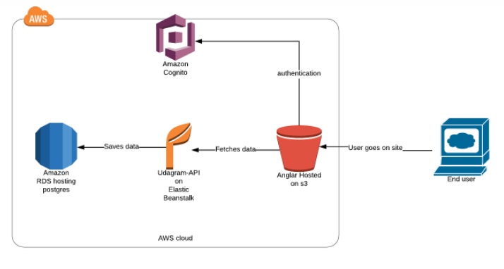

<h1 align="center"> Infrastructure </h1>

## AWS

AWS (Amazon Web Services) is a comprehensive, evolving cloud computing platform provided by Amazon that includes a mixture of infrastructure as a service (IaaS), platform as a service (PaaS) and packaged software as a service (SaaS) offerings.

## AWS Services

There are many AWS services, but the most relevant to this project are:

- Simple Storage Service (S3)

  

  Amazon Simple Storage Service (Amazon S3) is an object storage service that offers industry-leading scalability, data availability, security, and performance. You can use Amazon S3 to store and retrieve any amount of data at any time, from anywhere.

- Database Service (RDS)

  

  Amazon Relational Database Service (RDS) is a managed SQL database service provided by Amazon Web Services (AWS). Amazon RDS supports an array of database engines to store and organize data. It also helps with relational database management tasks, such as data migration, backup, recovery and patching.

- Elasticbeanstalk (EB)

  

  AWS Elastic Beanstalk is an easy-to-use service for deploying and scaling web applications and services developed with Java, . NET, PHP, Node. js, Python, Ruby, Go, and Docker on familiar servers such as Apache, Nginx, Passenger, and IIS.

## AWS Hook of Udagram App

We'll talk about the AWS Request lifecycle in this app

- First of all, the user accesses the front-end URL and that website is published on `S3`
- Then the front end needs to connect to the backend deployed on the `EB` to send or receive data for example
  - Registration: send data to be stored in the database.
  - Log: submit the data to check whether this data is correct or not.
  - Or get the data that will appear for each user
- Then the backend calls the database stored on `RDS` to get or store user data.
